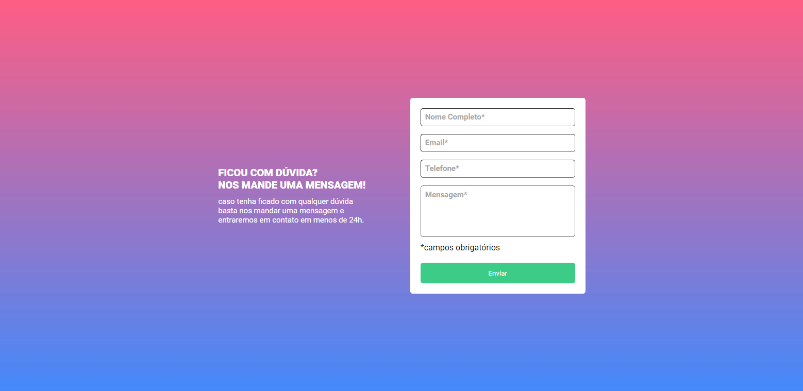

 
## Tabela de conteudo

- [Visao geral](#visao-geral)
  - [O projeto](#o-projeto)
  - [Screenshot](#esses-sao-os-estados-do-formulario)
  - [Links](#links)
  - [Built with](#built-with)

   
   

  ## Visao geral

### O projeto
Neste projeto eu coloco em prática meus conhecimentos de HTML/CSS/JavaScript, desenvolvendo um formúlario com validação realizada em JavaScript puro.  No qual, o usuário pode inserir seus dados e enviar uma pergunta/mensagem à empresa ou admins de um site.

 

## Esses sao os estados do formulario.

 

`Estado primario` 

 

`Estado inválido`

 

`Estado válidado`

 

### Links

- `Live Site URL: []`

### Built with

- `HTML5` 
- `CSS` 
- `JavaScript`
